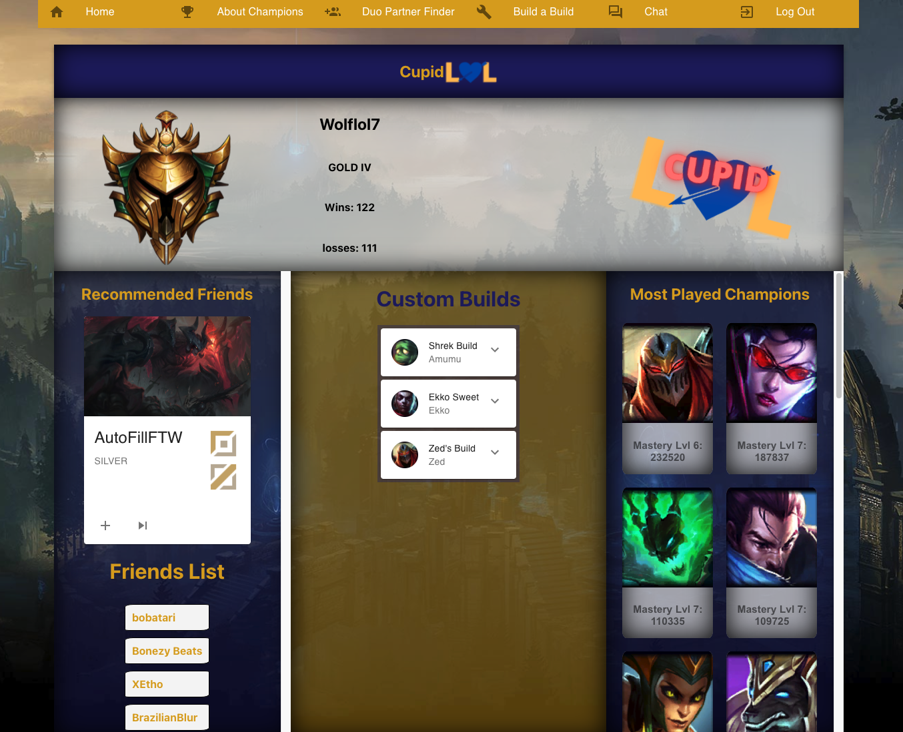
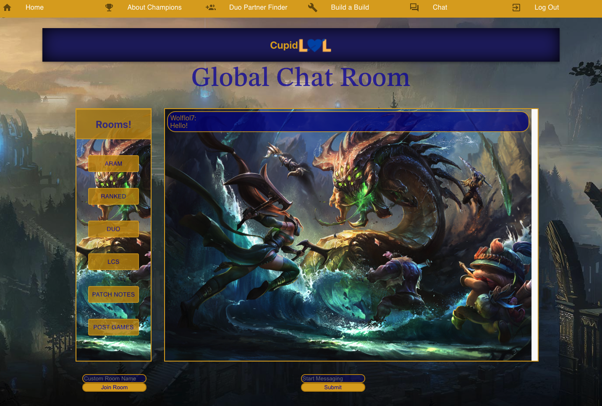

# cupid-lol-server

GitHub Repo for Cupid LOL graphql/react front and back end: [https://github.com/jbryant4/duoLOL] 

## Description

this is only a Live server for the Cupid LOL chat application.

A Full Stack MERN application utilizing GraphQL, Socket.io, and the RIOT API to build a place where League of Legends players can log in and meet other players.  Players can create character builds, add other users as friends, and chat with the community.

# Table of Contents

- [Technologies](#Technologies)
- [Installation](#Installation)
- [Usage](#usage)
- [Contributions](#Contributions)
- [Contact](#Contact)
- [License](#license)

## Technologies

- Socket.io
- Node.JS
- Express
- JWT

## Installation

- Clone the repo:

  use: `git clone https://github.com/CdHebert/cupid-lol-server` in the command line

- Install npm required dependencies by running (`npm run install`) in the command line.

- This script will Install required npm packages into Server directory by running the script.

## Usage

- npm start to start the server
- plug the server hosted site into the socketIo.service.js connection fetch inside the front end site you will be hosting

## Contributions

Developed by:
Joseph Bryant - Github Profile: (https://github.com/jbryant4)  
Robert Schwartz - Github Profile: (https://github.com/Robert-Schwartz)  
Cody Hebert - Github Profile: (https://github.com/CdHebert)  
Nathan da Silva - Github Profile: (https://github.com/PacSmack)  

## License

NPM  
MIT  
RIOT  
 
- We do not speak for or represent RIOT inc
